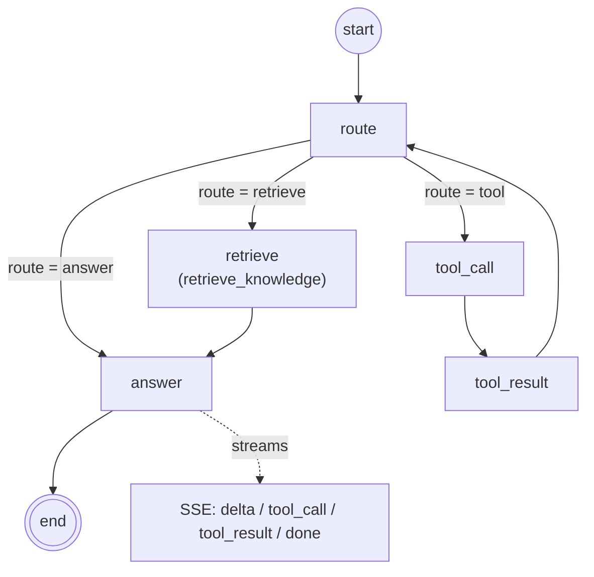

# Tutor Agent (LangGraph)

The tutor conversation type is powered by a LangGraph state graph. Instead of the
old Week 7 pipeline (always retrieve, then answer with/without RAG), a `route`
node decides per-turn whether to fetch grounded knowledge, call a user-data tool,
or answer directly. State is checkpointed in MongoDB so a conversation survives a
server restart and resumes mid-thread.

## Graph

- `route` — structured LLM decision that writes `state.route` (`retrieve | tool | answer`); source of the single conditional edge.
- `retrieve` — runs the `retrieve_knowledge` tool, stores the returned `Citation[]` in `state.citations`.
- `tool_call` — invokes the selected user-data tool (`search_my_messages`, `list_my_conversations`).
- `tool_result` — records the tool output back into `state.messages` and loops to `route` so the agent can decide the next move.
- `answer` — streams the final grounded reply token-by-token and attaches numbered citations.

## State schema

Defined in [`state.ts`](./state.ts) via `Annotation.Root`.

| Field | Type | Purpose |
|-------|------|---------|
| `messages` | `BaseMessage[]` | Checkpointed conversation history (reduced with `messagesStateReducer`). |
| `userId` | `string` | Auth-scoped user; set once server-side, never model-controlled. |
| `question` | `string` | The latest user turn, read by `route` and `answer`. |
| `route` | `'retrieve' \| 'tool' \| 'answer'` | Routing decision that drives the conditional edge. |
| `citations` | `Citation[]` | Most recent `retrieve_knowledge` result; feeds the answer's citations. |
| `lastToolCall` | `{ name: string; args: unknown } \| null` | The tool the agent last decided to invoke. |

## Tools

Defined in [`tools.ts`](./tools.ts). `userId` is bound into each tool closure, so it
is never a model-supplied argument — this keeps every tool scoped to the
authenticated user.

| Tool | Origin | What it does |
|------|--------|--------------|
| `retrieve_knowledge` | Week 7 RAG | Vector search over the user's uploaded documents; returns numbered sources + citation metadata. |
| `search_my_messages` | Week 6 user data | Keyword search across the user's own chat messages in all conversations. |
| `list_my_conversations` | Week 6 user data | Lists the user's conversations (id, title, type, last message). |

## Persistence

The compiled graph uses the LangGraph MongoDB checkpoint saver with
`thread_id = conversationId`, sharing the app's existing Mongoose connection.
Killing the server mid-conversation and restarting resumes from the last
checkpoint.

## Streaming

The agent emits Server-Sent Events over the existing
`GET /conversations/:id/assistant/stream` endpoint:

- `delta` — answer token chunk.
- `tool_call` — a tool is starting (with a human-readable label, e.g. "Searching your documents…").
- `tool_result` — a tool finished.
- `done` — final persisted message (including citations).
- `error` — failure.
